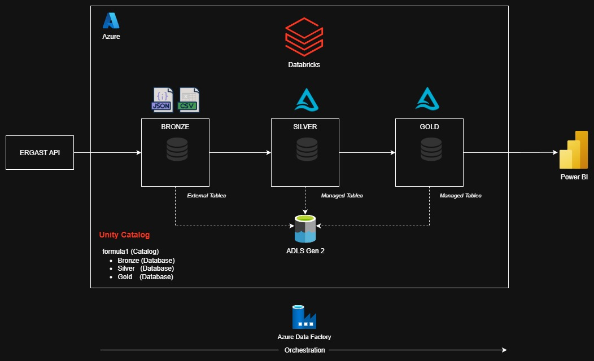

# 🏎️ databricks-f1-racing
This repository contains Databricks workspace for a personal project: Formula1 Racing Databricks Project. This project focuses on building end-to-end analytics pipeline on F1 racing data using Databricks and Azure Cloud. Data is ingested from Ergast API, and processed through Medallion Architecture (Bronze -> Silver -> Gold) to build curated models for visualization and insights in Power BI.

For a detailed overview of the project, please visit [this](https://wwww.ayush-m.com/projects/f1-racing-databricks-project.html) link.

---
## 📐 Architecture Overview

This project follows a classic Medallion Architecture:

- **Bronze**: Raw JSON/CSV data from Ergast API stored as External Tables
- **Silver**: Cleaned, standardized tables (snake_case, deduped, metadata added) stored as Managed Tables
- **Gold**: Curated analytical models for reporting stored as Managed Tables

Services Used

- **Databricks** for data processing
- **Azure Data Lake Storage Gen2** for storage
- **Delta Lake** for ACID, MERGE, and time travel
- **Unity Catalog** for governance and lineage
- **Azure Data Factory** for orchestration
- **Power BI** for visualizations

## 📁 Repository Structure

```text
├── set-up/                                    # Setting up Unity Catalog
│   ├── 10. Created External Location, Catalog and Schemas required for project
│  
├── raw/                                       # Bronze layer table creation
│   ├── 1. create_bronze_tables                
│
├── ingestion/                                 # Silver layer table creation      
│   ├── 1. ingestion_circuits_file
│   ├── 2. ingestion_races_file
│   ├── 3. ingestion_constructors_file
│   ├── 4. ingestion_drivers_file
│   ├── 5. ingestion_results_file
│   ├── 6. ingestion_pitstops_file
│   ├── 7. ingestion_lap_times_file
│   ├── 8. ingestion_qualifying_file
|
├── trans/                                     # Gold layer table creation
│   ├── 1. race_results    
│   ├── 2. driver_standings
│   ├── 3. constructor_standings
│   ├── 4. calculated_race_results
|
├── analysis/                                  # Notebooks for analytics
│   ├── 1. find_dominant_driver  
│   ├── 2. find_dominant_teams
│   ├── 3. viz_dominant_drivers
│   ├── 4. viz_dominant_teams
|
├── includes/                                  # Commaon functions and configuration
│   ├── common_functions 
│   ├── configuration
|
├── adf/                                      # ADF pipeline definitions
│   └── dataset/
│   └── linkedService/
│   └── pipeline/
│   └── trigger/   
│
├── databricks-f1-racing.dbc                  # DBC File for Project
├── databricks_f1_architecture.jpg            # Architecture digram for project
├── .gitignore
└── README.md
```

## 🔄 Pipeline Overview
### Bronze Layer
- Stores raw data as external tables directly on ADLS
- Schemas defined manually for reliability
- Mirrors source structure closely

### Silver Layer
- Converts column names to snake_case
- Removes duplicates and invalid records
- Flattens nested structures
- Adds metadata (data_source, file_date, ingestion_date)

### Gold Layer
Curated tables for analytics, including:
- Race Results
- Driver Standings
- Constructor Standings
- Calculated Race Results
  
## ⚡ Incremental Load Logic
To avoid reprocessing full datasets weekly, the pipeline uses **Delta Lake MERGE** operations:
- Tables partitioned by `race_id`
- `MERGE` matches on both `race_id` + primary key
- `WHEN MATCHED` → update
- `WHEN NOT MATCHED` → insert

This ensures idempotent, efficient, and scalable incremental updates.

## ▶️ How to Run

1. Clone this repository
2. Create git folder in Databricks workspace and provide the cloned repository url
3. Create ADLS with containers
4. Create Storage Credentials for ADLS
5. Configure your ADLS Gen2 paths in set-up file
6. Run the Bronze ingestion notebooks
7. Run Silver transformations
8. Run Gold model notebooks

## 🌟 Key Features

- Medallion Architecture (Bronze → Silver → Gold)
- Delta Lake with full ACID capabilities
- Incremental processing via MERGE
- Full data lineage using Unity Catalog
- Automated weekly orchestration with ADF
- Reproducible transformations with Delta Time Travel

## 📬 Contact
For any questions or feedback, reach out to me on:
- 📧 Email: ayushmanandhar10@gmail.com
- 🐙 GithHub: ayussshm
